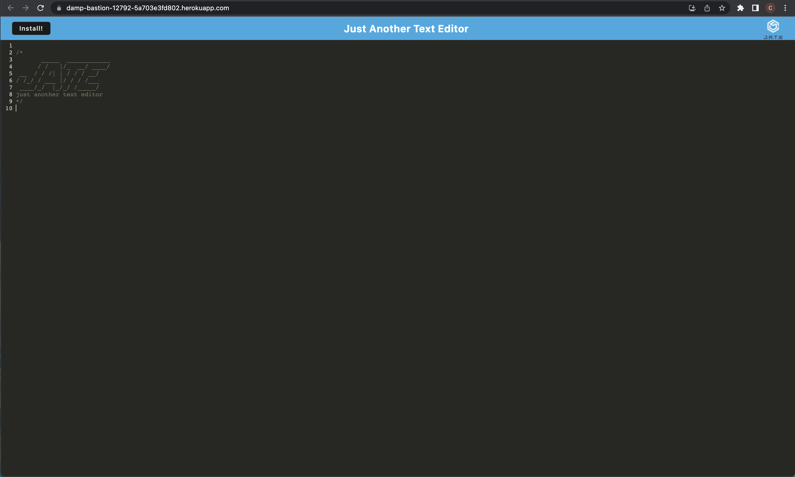

# Text Editor PWA
  
  ## Table of Contents
  * [Description](#description)
  * [Installation](#installation)
  * [Usage](#usage)
  * [Licenses](#licenses)
  * [Questions](#questions)

  ## Description 
This app allows to you create notes or code snippets without having to worry about an internet connection. Aloowing you to reliably retrieve them wheneven you need them.

## Installation 
npm i, npm run build
## Usage 
npm run start. or follow the Heroku link to my deployed application.
## Licenses 
  ## Licenses
    This project is covered under the MIT license. To learn more about what this means, click the license button at the top.
## Questions 
Any questions about the project?
Github: https://github.com/connormcgrew
Email: connormcgrew003@gmail.com